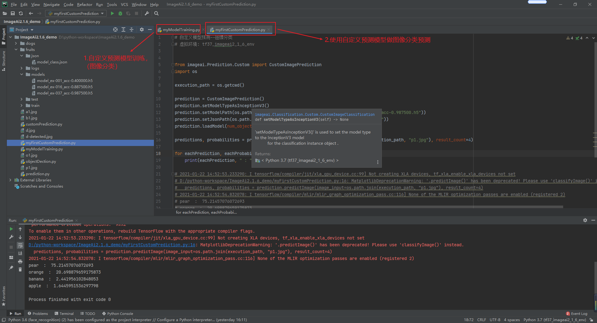
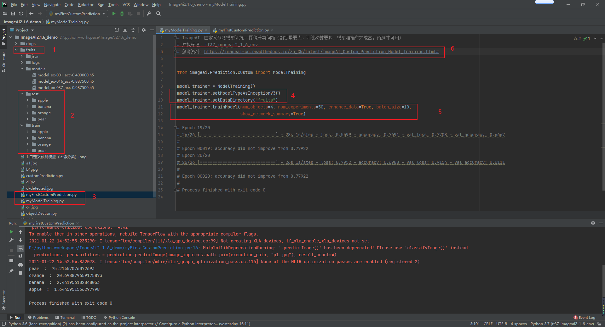
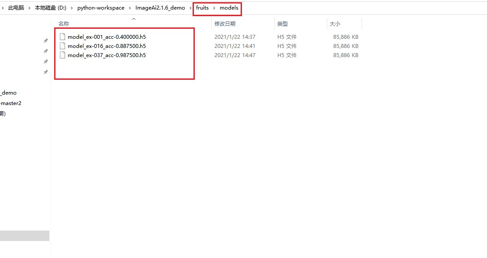
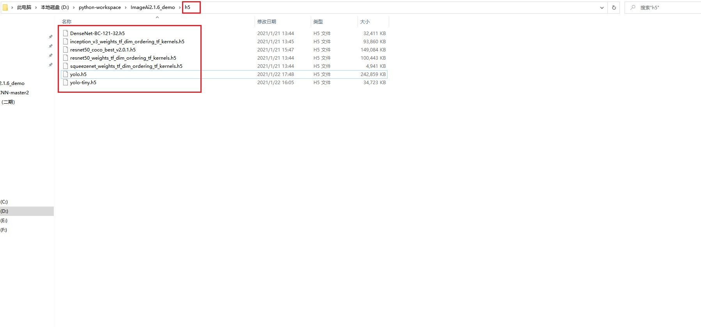
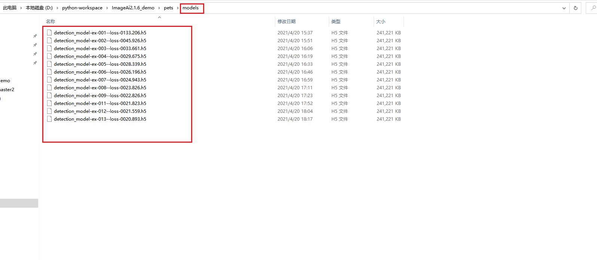
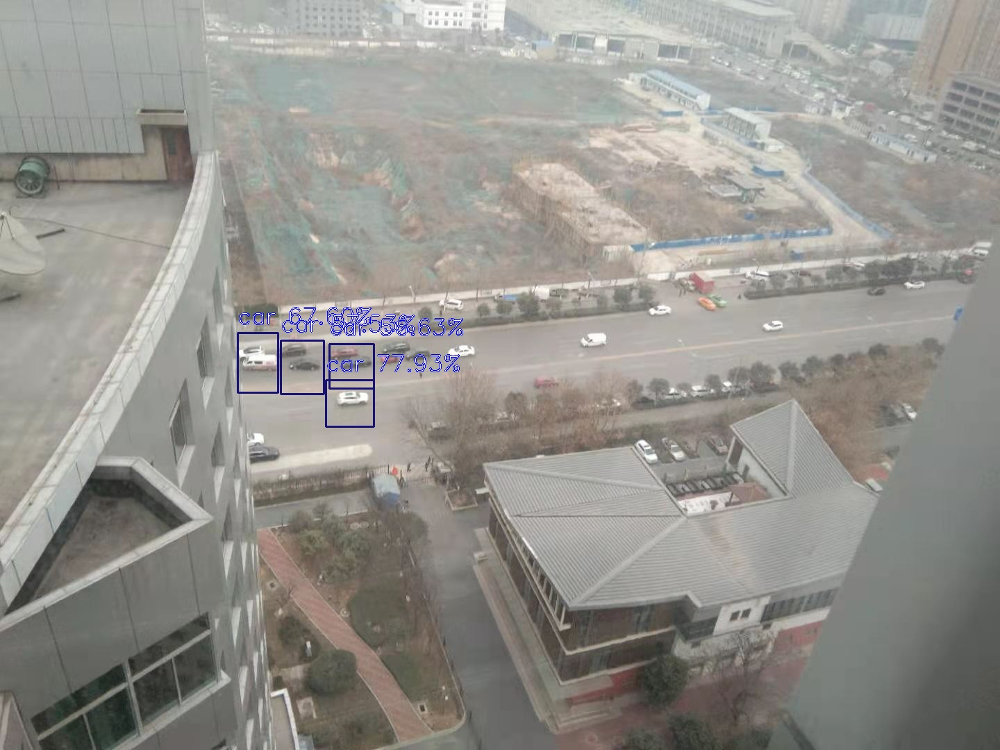
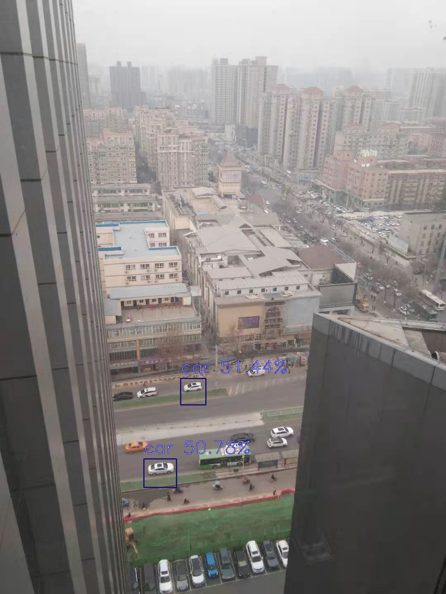

# ImageAi2.1.6_demo
基于ImageAI(v2.1.6)，训练自己的数据集，六行代码实现yolov3模型做目标检测，支持多种神经网络算法，输出目标的具体坐标，及分类概率。【本地win10，cpu已调通】

安装包如下：
pip命令集：（Python 3.7.9），ImageAI (v2.1.6)
pip install imageai --upgrade   
pip install keras==2.4.3
pip install numpy==1.19.3
pip install tensorflow==2.4.0
pip install opencv-python
pip install Keras==2.4.3
pip install pillow==7.0.0
pip install scipy==1.4.1
pip install h5py==2.10.0
pip install matplotlib==3.3.2
pip install keras-resnet==0.2.0

////////////////////////////////////////////////////////////////
参考资料地址：
github地址：https://github.com/OlafenwaMoses/ImageAI#installation
ImageAI开发文档：https://imageai-cn.readthedocs.io/zh_CN/latest/ImageAI_Custom_Prediction_Model_Training.html#
ImageAI（2）——6行代码训练自己的yolov3模型（python）：https://blog.csdn.net/qq_40784418/article/details/106038094
//////////////////////////////////////////////////////////////////////////////////////////////

(tf37_imageai2_1_6_env) C:\Users\DELL>pip list
Package                Version
---------------------- -------------------
absl-py                0.11.0
astunparse             1.6.3
cachetools             4.2.0
certifi                2020.12.5
chardet                4.0.0
cycler                 0.10.0
flatbuffers            1.12
gast                   0.3.3
google-auth            1.24.0
google-auth-oauthlib   0.4.2
google-pasta           0.2.0
grpcio                 1.32.0
h5py                   2.10.0
idna                   2.10
imageai                2.1.6
importlib-metadata     3.4.0
Keras                  2.4.3
Keras-Preprocessing    1.1.2
keras-resnet           0.2.0
kiwisolver             1.3.1
labelImg               1.8.4
lxml                   4.6.2
Markdown               3.3.3
matplotlib             3.3.2
numpy                  1.19.3
oauthlib               3.1.0
object-detection       0.1
opencv-python          4.5.1.48
opt-einsum             3.3.0
Pillow                 7.0.0
pip                    20.3.3
protobuf               3.14.0
pyasn1                 0.4.8
pyasn1-modules         0.2.8
pyparsing              2.4.7
PyQt5                  5.15.2
PyQt5-sip              12.8.1
python-dateutil        2.8.1
PyYAML                 5.4
requests               2.25.1
requests-oauthlib      1.3.0
rsa                    4.7
scipy                  1.4.1
setuptools             51.3.3.post20210118
six                    1.15.0
tensorboard            2.4.1
tensorboard-plugin-wit 1.8.0
tensorflow             2.4.0
tensorflow-estimator   2.4.0
termcolor              1.1.0
typing-extensions      3.7.4.3
urllib3                1.26.2
Werkzeug               1.0.1
wheel                  0.36.2
wincertstore           0.2
wrapt                  1.12.1
zipp                   3.4.0

(tf37_imageai2_1_6_env) C:\Users\DELL>

